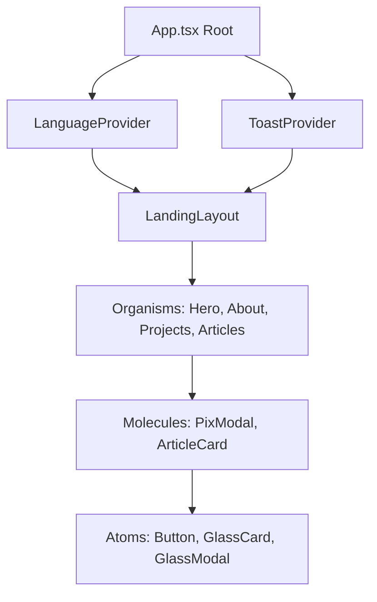

# 🏗️ GlassHub Engine - System Architecture

This document provides a comprehensive overview of the architecture of **GlassHub Engine**. It explains how the project is organized, how data flows through components, how routing works without external router bloat, and how error resilience is guaranteed.

---

## 🏛️ Architectural Principles

GlassHub is designed according to three primary software architectural tenets:
1. **Clean Architecture & Separation of Concerns:** Business logic (e.g., EMV Pix payload generation), UI components, state management, and localized static content are completely decoupled into distinct directory domains.
2. **Atomic Design Methodology:** UI elements are categorized into strict physical hierarchies (Atoms, Molecules, Organisms, Templates) to maximize reusability and prevent component bloatedness.
3. **Resilient Fault Tolerance:** Unexpected runtime exceptions are contained within isolated boundary sandboxes (`GlassErrorBoundary`), preventing full-page application crashes.

---

## 🧩 Atomic Design Component Hierarchy

Atomic Design structures UI elements into 5 distinct building blocks:

```text
Atoms (Primitives) ──► Molecules (Composites) ──► Organisms (Sections) ──► Templates (Layouts) ──► Pages (App)
```

### 1. ⚛️ Atoms (`src/components/atoms/`)
*Definition:* The smallest possible UI building blocks that cannot be broken down further without losing their functionality.
- **`Button.tsx`**: Universal button primitive supporting multiple visual variants (`glow-primary`, `glass`, `ghost`, `danger`), loading states, and left/right icon slots.
- **`GlassCard.tsx`**: Core glassmorphic container providing backdrop blur filters (`backdrop-blur-md`), translucent border highlights, and hover tilt effects.
- **`GlassModal.tsx`**: Portal container leveraging `React.createPortal` to render overlays directly under `document.body`, featuring `Esc` key handling, backdrop click dismissals, and body scroll-locking.
- **`GlassErrorBoundary.tsx`**: React Class Error Boundary that intercepts UI render exceptions and displays a user-friendly recovery interface.
- **`Heading.tsx` & `Text.tsx`**: Typography primitives enforcing text gradients, semantic levels (`h1`-`h6`), and responsive scale tokens.
- **`Badge.tsx`**: Visual status tag primitive with glow rings and micro-indicators.
- **`LanguageToggle.tsx`**: Interactive switch component toggling between `en` and `pt`.
- **`BrandIcons.tsx`**: Custom SVG brand icons (GitHub, LinkedIn, Instagram, EMV Pix, PayPal).

### 2. 🧪 Molecules (`src/components/molecules/`)
*Definition:* Groups of 2 or more Atoms bound together to form cohesive functional units.
- **`PixModal.tsx` & `PixQrModal.tsx`**: Composed payment dialogs combining `GlassModal`, `PixQrCustom`, numeric copy feedback buttons, and instant clipboard utilities.
- **`PixQrCustom.tsx`**: Wrapper around `qr-code-styling` integrating dynamic embedded SVG logos, rounded corners, and linear gradients.
- **`PayPalDonateButton.tsx`**: Dynamic SDK script injector and button renderer with fallback links.
- **`ArticleCard.tsx`**: Card molecule displaying article metadata, read time, target tags, and click action handlers.
- **`ProjectCard.tsx`**: Card molecule featuring live project links, repository badges, tech stack tags, and glass hover glows.
- **`ContributionCard.tsx`**: Card molecule for crowdfunding tiers and support options.
- **`CosmicBackground.tsx`**: Canvas/CSS background molecule rendering animated glowing stars, nebulae, and gradient particles.
- **`NavItem.tsx`**: Smooth-scrolling navigation item with active indicator lines.
- **`SocialLink.tsx`**: Interactive social badge link with hover scaling.

### 3. 🔬 Organisms (`src/components/organisms/`)
*Definition:* Complex, self-contained sections combining Molecules and Atoms into full feature areas.
- **`Header.tsx`**: Sticky top bar with cosmic brand logo, navigation menu, i18n switcher, and mobile hamburger drawer.
- **`HeroSection.tsx`**: Landing screen with animated headline, quick call-to-actions, and status indicators.
- **`AboutMeSection.tsx`**: Personal bio section with interactive career narrative modals.
- **`AboutGlassHubSection.tsx`**: Deep dive into the GlassHub platform vision and architecture.
- **`ProjectsSection.tsx`**: Grid container organizing and filtering featured ecosystem projects.
- **`ArticlesSection.tsx`**: Grid layout presenting engineering articles and case studies.
- **`ArticleReaderPage.tsx`**: Dedicated full-page article reader rendering Markdown content, table of contents, and back navigation.
- **`ContributionSection.tsx`**: Support hub containing Pix BR Code generator, PayPal checkout, and Patreon links.
- **`Footer.tsx`**: Application footer with license notice, repository links, and cosmic signature.

### 4. 📄 Templates & Layouts (`src/components/templates/`)
*Definition:* Page-level layout containers that dictate structural positioning and grid grids without binding specific content data.
- **`LandingLayout.tsx`**: Master wrapper orchestrating the fixed header, dynamic main content area, sticky background shader, and global footer.

---

## 🔄 State Management & Unidirectional Data Flow

GlassHub uses **React Context** for global state and standard props down / events up for local state.



### 1. Language Context (`src/context/LanguageContext.tsx`)
- Maintains the active locale state (`'pt'` or `'en'`).
- Automatically reads initial locale preference from `localStorage.getItem('glasshub_lang')` or falls back to browser settings (`navigator.language`).
- Persists user choice to `localStorage`.
- Provides type-safe translation dictionaries via `useLanguage()` hook.

### 2. Toast Context (`src/context/ToastContext.tsx`)
- Provides a lightweight notification system (`showToast(message, type)`).
- Renders animated toast popups at the bottom-right of the screen for clipboard copies and feedback.

---

## 🧭 Light-Weight History & URL Routing Engine

Instead of adding heavy client-side router libraries (e.g., `react-router-dom`), GlassHub implements a native browser History API routing engine in `src/App.tsx`.

### 1. Dual-View Mode Engine
- **Landing View:** Displays all home sections (`Hero`, `AboutMe`, `AboutGlassHub`, `Projects`, `Articles`, `Contribution`).
- **Article Reader View:** Activated when `selectedArticleSlug` is non-null. Hides home sections and renders `ArticleReaderPage`.

### 2. Synchronization Mechanisms
- **URL Parameter Sync:** URL parameters like `?article=clean-architecture` reflect active article reader state without triggering full page reloads.
- **Browser History Integration (`pushState` & `popstate`):** Clicking back/forward in the browser fires `popstate` listeners in `App.tsx`, seamlessly updating `selectedArticleSlug`.
- **Clean Anchor Navigation:** When leaving an article, query parameters are removed, and smooth scrolling (`element.scrollIntoView({ behavior: 'smooth' })`) brings the user to the target section anchor (e.g., `#projects`).

---

## 🛡️ Exception Handling & Fault Tolerance

```tsx
<GlassErrorBoundary onReset={() => handleNavigateSection('articles')}>
  <ArticleReaderPage articleSlug={selectedArticleSlug} />
</GlassErrorBoundary>
```

If an error occurs while parsing article Markdown or executing a third-party script inside `ArticleReaderPage`:
1. `GlassErrorBoundary` catches the exception in `componentDidCatch`.
2. The error boundary prevents the unmounted root application tree from crashing.
3. A cosmic error UI is presented with an amber warning glow and a single reset action ("Return to Main Portal").
4. Triggering reset clears the error state and safely redirects the user back to the articles section list.

---

<div align="center">
  <sub>GlassHub Ecosystem • Architectural Specification</sub>
</div>
